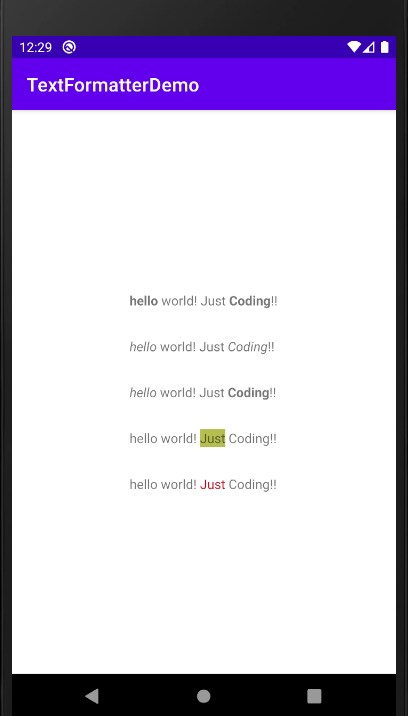

# TextFormatter
For formatting text in android like what whatsapp does. Any text enclosed with *s will be bolded, any text enclosed within _s will be italicized. 
Example :
"* Hello * World!" will become "**Hello** World" and "_Hello_ World!" will become "*Hello* World"

## Setup

####  Add the gradle dependency

Add JitPack repository to your root build.gradle at the end of repositories:
```
allprojects {
		repositories {
			...
			maven { url 'https://jitpack.io' }
		}
	}
```
Add the dependency:
```
dependencies {
	        implementation 'com.github.AniruddhaChattopadhyay:TextFormatter:Tag'
	}

* Library Functions: 
### 1) FormatText.bold(String text) :
       The function will return a charSequence with *..text..* replaced by the text within *s bolded.
       
### 2) FormatText.italics(String text) :
       The function will return a charSequence with _..text.._ replaced by the text within _s italicized.

### 3) FormatText.boldAndItalics(String text) :
       The function will return a charSequence with texts enclosed in *s and _s replaced by those texts bolded and italicized.
       
### 4) FormatText.colorText(String text,String hexColor,boolean isBackground) :
       The function will return a charSequence with #..text..# replaced by ..text.. colored as hexColor
       (if isBackground is true, the color will be in the ..text.. beckground else the text will be colored with the hexColor.)
       
* Example code: 
```java
        boldText = "*hello* world! Just *Coding*!!";
        italicsText = "_hello_ world! Just _Coding_!!";
        boldItalicsText = "_hello_ world! Just *Coding*!!";
        colorText = "hello world! #Just# Coding!!";

        FormatText.bold(boldText); 
        FormatText.italics(italicsText);
        FormatText.boldAndItalics(boldItalicsText);
        FormatText.colorText(colorText,"#b5bf50",true);
        
        FormatText.colorText(colorText,
                            "#cd001a",
                            false);
```
<p align="center">

</p>

## Developed By
#### Aniruddha Chattopadhyay
* [LinkedIn](linkedin.com/in/aniruddha-chattopadhyay-448912105/)
* studyaniruddha@gmail.com

Please feel free to suggest any new features to be added to the Library.


## License
```
MIT License

Copyright (c) 2020 Aniruddha Chattopadhyay

Permission is hereby granted, free of charge, to any person obtaining a copy
of this software and associated documentation files (the "Software"), to deal
in the Software without restriction, including without limitation the rights
to use, copy, modify, merge, publish, distribute, sublicense, and/or sell
copies of the Software, and to permit persons to whom the Software is
furnished to do so, subject to the following conditions:

The above copyright notice and this permission notice shall be included in all
copies or substantial portions of the Software.
